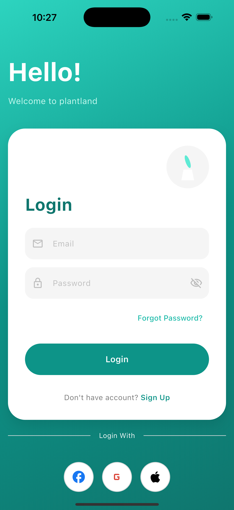
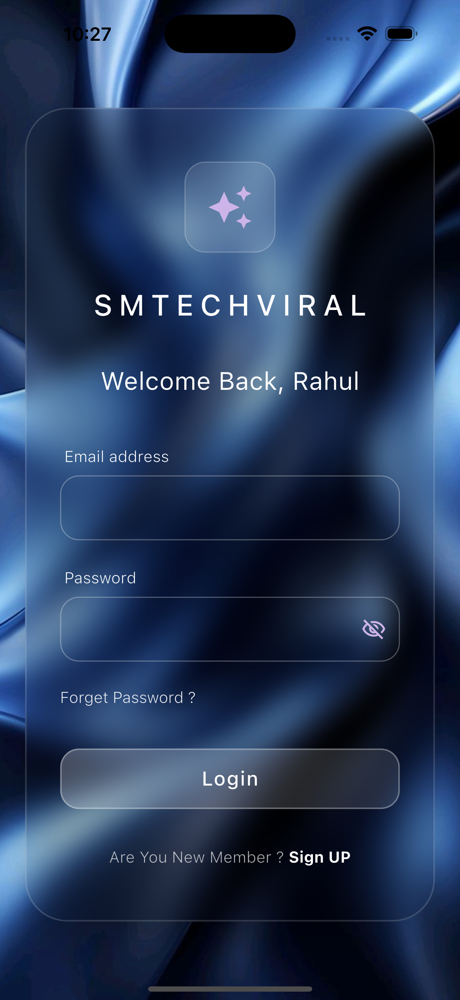
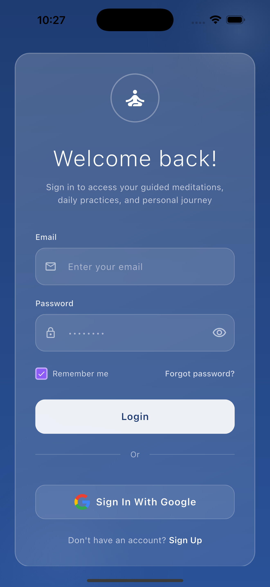
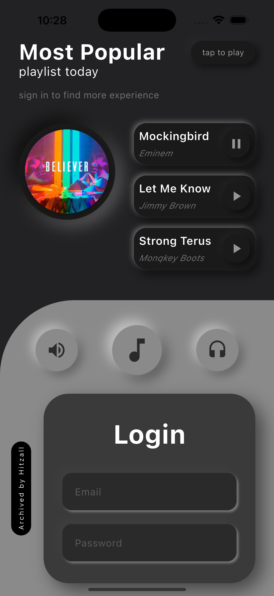
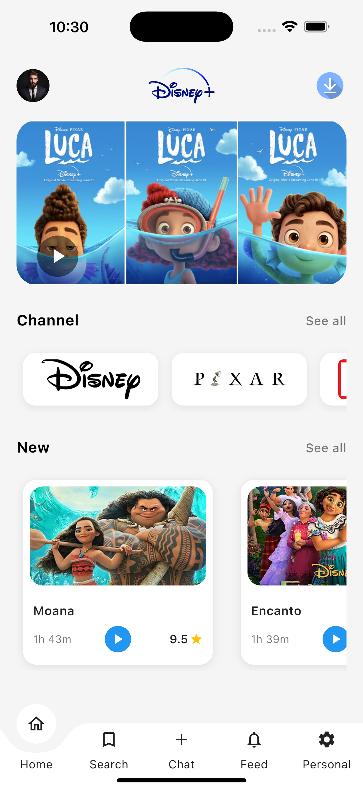
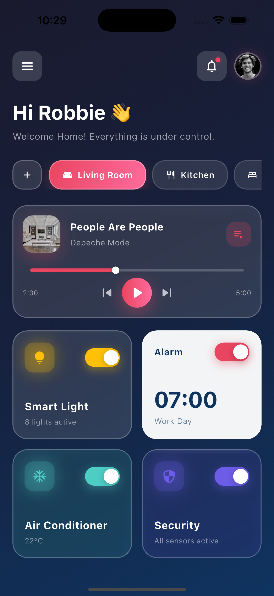
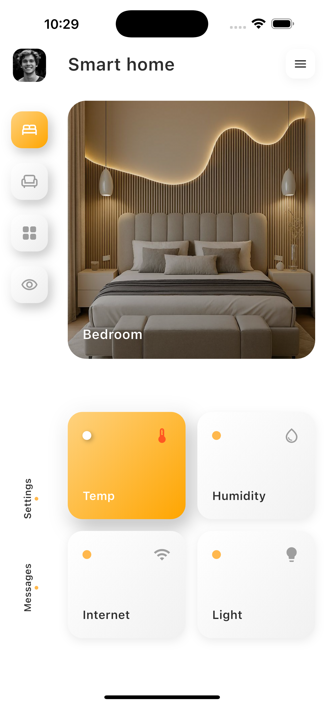
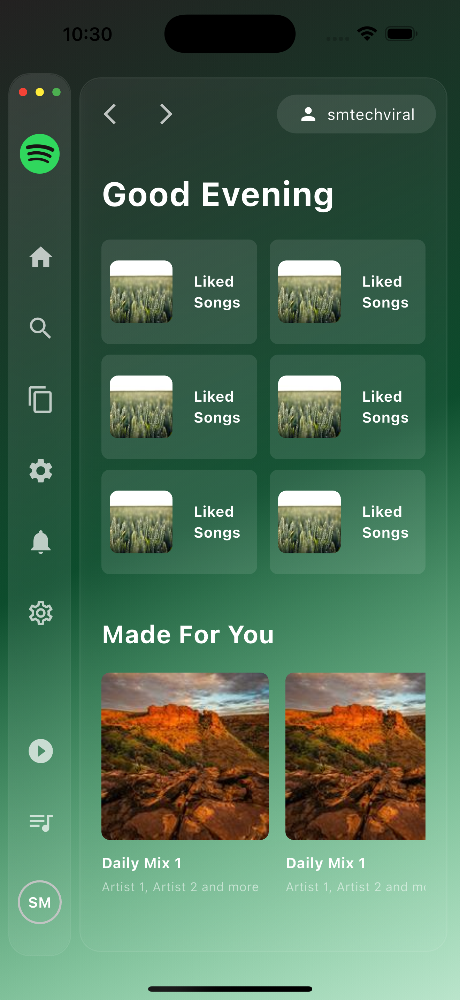
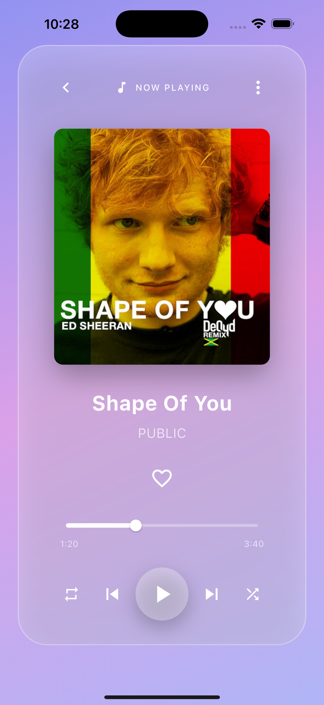

# 🚀 Top 100 Flutter App

A **production-ready Flutter application** built with clean architecture, scalable structure, and modern best practices.  
This project demonstrates how to build a **high-quality Flutter app** suitable for startups, enterprises, and long-term maintenance.

---

## 📌 Table of Contents
- Overview
- Features
- Tech Stack
- Architecture
- Folder Structure
- State Management
- Screens
- Installation
- Environment Setup
- Run App
- Build & Release
- Performance
- Security
- Error Handling
- API Integration
- Local Storage
- Responsive UI
- Animations
- Theme
- Internationalization
- Testing
- CI/CD
- Code Quality
- Scalability
- Future Improvements
- Contributing
- License

---

### ☕ Support Me

<a href="https://buymeacoffee.com/smtechviral" target="_blank">
  
</a>


## 🧠 Overview
This Flutter app is developed using **industry-level best practices** focusing on:

- Clean & readable code
- High performance
- Scalability
- Maintainability

Ideal as a **Top Flutter reference project** or production starter app.

---

## ✨ Features
- Modern UI/UX
- Clean Architecture
- State Management
- REST API Integration
- Pagination & Search
- Offline Support
- Secure Storage
- Responsive Layout (Mobile / Tablet / Web)
- Dark & Light Theme
- Error & Network Handling
- Optimized Performance

---

## 🛠 Tech Stack
- **Flutter** (Latest Stable)
- **Dart**
- State Management: GetX / Riverpod / Bloc
- Networking: Dio / http
- Local Storage: SharedPreferences / Hive
- Image Caching: CachedNetworkImage
- Animations: Lottie / Hero Animations

---

## 🏗 Architecture
This app follows **Clean Architecture**:

- Presentation Layer (UI)
- Domain Layer (Business Logic)
- Data Layer (API / Local Database)

✅ Testable  
✅ Scalable  
✅ Easy to maintain

---

## 📱 App Screenshots

<p float="left">
  
  
  
  
  
</p>

<p float="left">
  
  
  
  
</p>


## 📂 Folder Structure
```text
lib/
 ├── core/
 │   ├── constants/
 │   ├── theme/
 │   ├── utils/
 │   └── widgets/
 ├── data/
 │   ├── models/
 │   ├── services/
 │   └── repositories/
 ├── modules/
 │   ├── auth/
 │   ├── home/
 │   └── profile/
 ├── routes/
 └── main.dart
